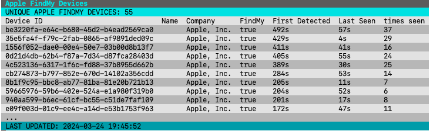

# findmyBLEscanner
**Objective**
> This should not work on both `Linux`, and `Mac os` Untested on `windows`

Bluetooth device scanner in two routines
- scanner routine
  - Detects and maintains a list of local Bluetooth devices, sorts and passes down an ingest path.
- screen writer routine.
  - Receives pre-sorted list of devices on the ingest path, and prints them to a table.

**Screenshot**

> Below is an AI generated breakdown of how this code works.

## Screen Writer
**Purpose**

Displays the output of the Bluetooth scanner in a neatly formatted table on the terminal screen. It does this by:

1. **Receiving device data:**  Reads the stream of scanned device data from a channel.
2. **Formatting the data:**  Prepares data rows for a table, including resolving company names and marking "Find My" devices.
3. **Table Management:** Uses the `go-pretty/table` library to create, style, and render the table.
4. **Clearing the Screen:** Ensures a clean display for each update.

**Types**

* **`screenWriter`** struct: Represents the component responsible for writing to the screen.
   * `wg`: WaitGroup for coordination.
   * `ptab`: A `table.Writer` instance from the `go-pretty/table` library.
   * `header`: The table's header row.
   * `quit`: Channel to signal stopping the writer.
   * `readPath`: Channel from which it receives device data 

**Functions**

* **`newWriter(...)`** Constructor for creating a `screenWriter`. Initializes the table writer and other settings.

* **`startWriter(...)`** Bootstraps the screen writer process. Creates a `screenWriter` and starts its execution loop.

* **`execute()`** The main loop of the `screenWriter`:
    * Waits for signals on the `quit` channel to stop.
    * Waits for device data on the `readPath` channel.
    * Calls `Write` to update the table when data arrives.

* **`Write(devs []devContent)`** Handles the table updates:
    * Iterates over the received device data.
    * Calls helper functions like `resolveCompanyIdent` and `isFindMyDevice` to process device information. 
    * Appends new rows to the table.
    * Clears the screen with `clearScreen` (you'll need to implement this function).
    * Renders the updated table.
    * Resets the table rows for the next update.

* **Helper Functions**
* **`resolveCompanyIdent(c *CorpIdentMap, t uint16) string`:**
    * Takes a pointer to the `CorpIdentMap` (`c`) and a company identifier (`t`).
    * Looks up the identifier in the map.
    * Returns the corresponding company name if found, or "Unknown" if not.

* **`ingestCorpDevices(loc string) CorpIdentMap`:**
    1. Opens the YAML file at the given location (`company_identifiers.yaml`).
    2. Defines structs to model the YAML data.
    3. Uses a YAML decoder to read the file contents into the `CompanyIdentifiers` struct.
    4. Iterates over the decoded data, populating the `CorpIdentMap`. 
    5. Returns the filled `CorpIdentMap`.

* **`isFindMyDevice(b map[uint16][]byte) bool`:**
    * Takes the device's manufacturer data (`b`).
    * Iterates through the manufacturer data, checking if the first byte of any entry matches the "Find My" ID.
    * Returns `true` if a match is found, otherwise `false`.

* **`getCompanyIdent(md manData) uint16`:**
    * Takes the device's manufacturer data (`md`).
    * If the data isn't empty, it simply returns the first manufacturer ID found (assumes that's how the company ID is embedded). 

---
## BLE Scanner
This code implements a Bluetooth Low Energy (BLE) device scanner. Its essential functions are:

1. **Scanning for BLE Devices:** Discovers nearby BLE devices and gathers their data.
2. **Storing Device Information:** Maintains a list of discovered devices along with information like their addresses, manufacturer data, and the time they were last seen.
3. **Transmitting Device Data:** Regularly sends the collected device data downstream for further processing.
4. **Managing Old Devices:**  Removes devices from the list if they haven't been seen within a specified time threshold.

**Package and Imports**

* **`main`:**  The main package for the executable program.
* **`fmt`:**  Standard input/output (I/O) formatting.
* **`log`:**  Simple logging.
* **`reflect`:**  Runtime type inspection.
* **`sort`:**  Sorting.
* **`sync`:**  Synchronization primitives (e.g., WaitGroup).
* **`time`:**  Time-related functions.
* **`tinygo.org/x/bluetooth`:**  Bluetooth library (assumed to be TinyGo-specific).

**Constants**

Defines time intervals and buffer sizes for the scanning and data processing:

* **`scanRate`:** How often to start a new scan.
* **`scanBufferSize`:** Capacity of the channel receiving scan results.
* **`scanLength`:**  How long each scan lasts.
* **`writeTime`:** How often to send the collected devices to the ingest path.
* **`trimTime`:** How often to remove old devices from the storage.
* **`oldestDevice`:** Maximum age for devices in storage.

**Types**

* **`scanner` struct:** Represents the BLE scanner object.
  * `wg`: WaitGroup for coordination.
  * `adptr`: Bluetooth adapter.
  * `devices`: Map storing device data (Key: UUID, Value: map[UUID]devContent)
  * `count`: Count of discovered devices.
  * `start`:  Timestamp of when the scan began.
  * `quit`: Channel to signal stopping the scan.
  * `ingPath`: Channel to send device data.
* **`DevContentList`:** A sortable slice of `devContent` structs.
* **`ingestPath`:**  A channel for transmitting the discovered device data.
* **`devContent`** struct:** Represents information about a single BLE device
  * `id`: UUID of the device.
  * `manufacturerData`: Raw manufacturer data.
  * `localName`: Device's advertised name.
  * `companyIdent`:  Company identifier extracted from manufacturer data.
  * `lastSeen`: Timestamp when the device was last observed.

**Functions**

* **`scan(returnPath chan bluetooth.ScanResult)`:**  The core scanning function.  Performs repeated scans and sends results on the `returnPath` channel.
* **`newScanner(...)`:** A constructor to create a new `scanner` object.
* **`startScan()`:** Starts the scanner's main loop (scanning, writing data, and trimming).
* **`startBleScanner(wg *sync.WaitGroup, ingPath ingestPath, q chan any)`:** Bootstraps the scanner, sets up the Bluetooth adapter, and starts the scanning process.
* **`scanlog(s string)`:** Simple logging function.
* **`TrimMap()`:** Removes stale device entries from the `devices` map.
* **`sortAndPass()`:**  Sorts the devices by ID and sends them on the `ingPath`.
