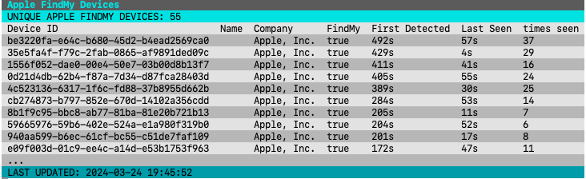

# Apple FindMy Device Detector

A Bluetooth scanner that shows you what Apple FindMy devices (AirTags and
similar) have been in range, and for how long. Tested on Windows, Linux, and
macOS.

**Screenshot**



## How it works

Two goroutines connected by a channel:

- **Scanner** — repeatedly scans for nearby BLE devices, tracks each one's
  manufacturer data and last-seen time, and drops anything that hasn't been
  seen recently. Sends the current device list downstream on an interval.
- **Screen writer** — receives that list, resolves company IDs against the
  official Bluetooth assigned-numbers registry, flags anything broadcasting
  the FindMy identifier, and renders it all as a live-updating terminal table.

## Quick start

```sh
go build
./AppleFindMyDeviceDetector
```

Requires a Bluetooth adapter and the OS permissions to use it (on Linux this
usually means running with appropriate capabilities/permissions for BLE
scanning).

**Known issue:** on Windows, screen redraws flicker — haven't found a clean
fix for the buffering yet.

## Credits

- [Adam Catley's AirTag write-up](https://adamcatley.com/AirTag.html) — the
  reference used for the FindMy/AirTag advertisement format.
- [Bluetooth SIG assigned-numbers list](https://www.bluetooth.com/specifications/assigned-numbers/) —
  used to resolve company identifiers.
